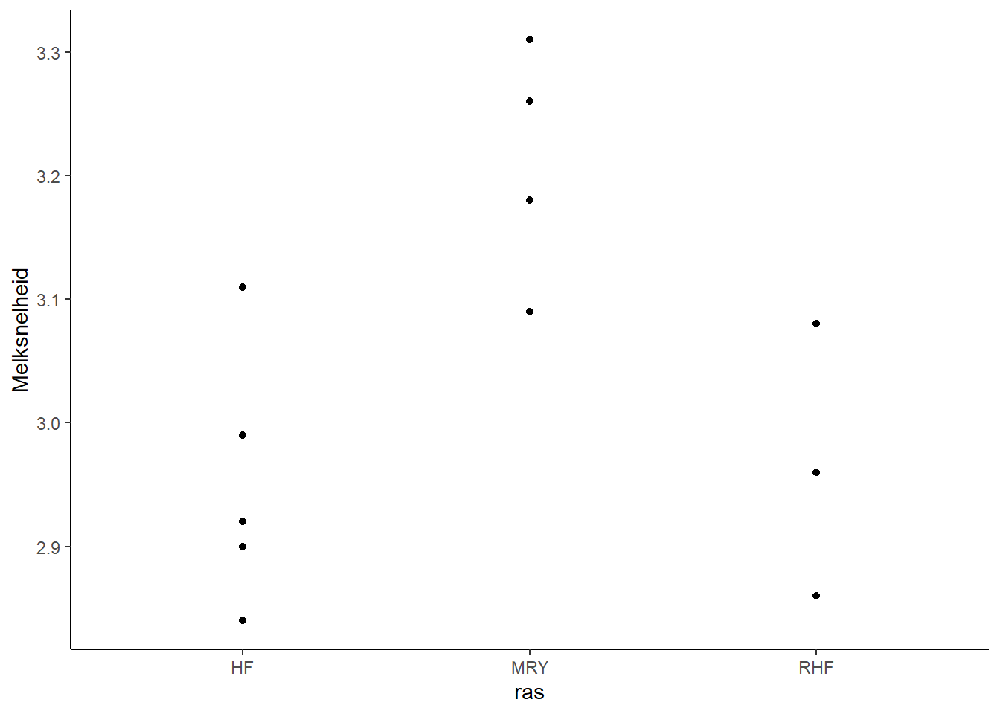
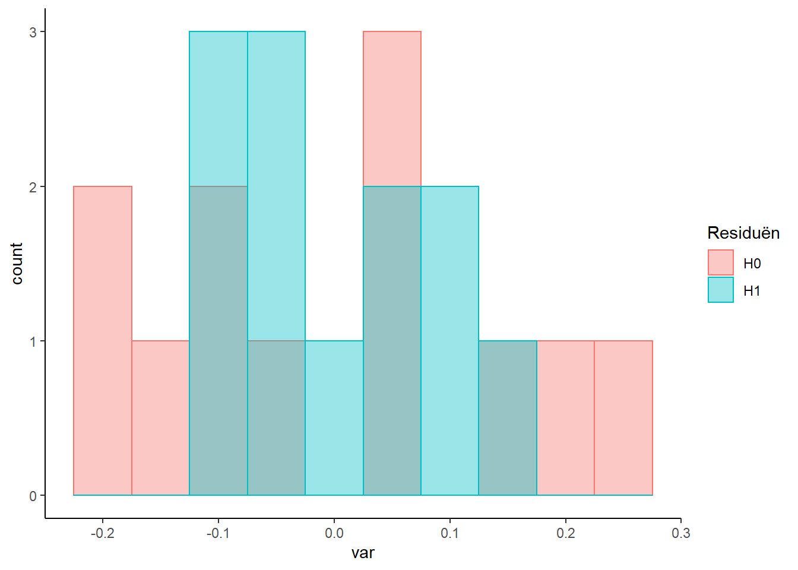

#Les 5: One-way ANOVA

\BeginKnitrBlock{ABD}<div class="ABD">
Lees Chapter 15 (*Comparing means of more than two groups*):
</div>\EndKnitrBlock{ABD}

Met een **One-way ANOVA** kan je, i.t.t. de onafhankelijke t-toets, meer dan twee groepen met elkaar vergelijken.
Je hebt dan één verklarende variabele van nominaal of ordinaal niveau, verdeeld in drie of meer groepen.
Je kan dat testen of de groepen van elkaar verschillen.
Wil je weten welke groepen onderling van elkaar verschillen, dan doe je dat met een **posthoctoets**.

##Variantieanalyse
Men doet onderzoek naar de melksnelheid van drie verschillende rassen koeien (HF, MRY en RHF) waarbij de melksnelheid in kg/min is gemeten bij een aantal koeien van deze rassen, zie hieronder:



Melkgift is de **responsvariabele** en ras de **verklarende variabele**.
Nu is de vraag of de rassen van elkaar verschillen in melkgift.
Uitgedrukt in hypotheses:

* H~0~: gemiddelde melkgift is gelijk voor de drie rassen
* H~1~: gemiddelden melkgift zijn niet allemaal gelijk voor de drie rassen

Onder de H~0~ kan de data beschreven worden als één populatie met gemiddelde is 3.04 kg/min.
Onder de H~1~ heeft ieder ras een eigen gemiddelde.

We kunnen in de grafiek al zien dat ras MRY nogal afwijkt van de andere twee.
Met een ANOVA kunnen we berekenen hoe waarschijnlijk het is dat we een minstens zo afwijkend patroon zien als de H~0~ wel waar is (dus geen verschil).

Hoe voeren we dat uit in R:

```r
fit <- lm(Melksnelheid ~ ras, data=koeien)
summary(fit)
```

```
## 
## Call:
## lm(formula = Melksnelheid ~ ras, data = koeien)
## 
## Residuals:
##      Min       1Q   Median       3Q      Max 
## -0.12000 -0.06567 -0.01833  0.06250  0.15800 
## 
## Coefficients:
##             Estimate Std. Error t value Pr(>|t|)    
## (Intercept)  2.95200    0.04589  64.334 2.67e-13 ***
## rasMRY       0.25800    0.06883   3.748  0.00457 ** 
## rasRHF       0.01467    0.07493   0.196  0.84916    
## ---
## Signif. codes:  0 '***' 0.001 '**' 0.01 '*' 0.05 '.' 0.1 ' ' 1
## 
## Residual standard error: 0.1026 on 9 degrees of freedom
## Multiple R-squared:  0.6427,	Adjusted R-squared:  0.5633 
## F-statistic: 8.094 on 2 and 9 DF,  p-value: 0.009743
```

Op de laatste regel van de output staat het resultaat van de F-toets.
De p-waarde is 0.0097432. 
Het is dus heel onwaarschijnlijk dat de H~0~ waar is, en kunnen die met een gerust hart verwerpen.

De F-waarde is 8.0941106.
De waarde staat voor de verhouding van verklaarde variantie door het model en overgebleven variantie.
Hoe grote de F-waarde, des te beter het model de totale variantie verklaart.

We kunnen de totale variantie en overgebleven variantie weergeven in een histogram:



De volgende opgave is gebaseerd op een onderzoek, gepubliceerd in the *American Society of Animal Science*.
Het sporenelement silicium (Si) heeft een positieve invloed op de gezondheid van beenderen.
In een onderzoek wil men de vraag beantwoord zien of het toevoegen van voedingssupplementen met silicium aan het rantsoen van zogende merries het siliciumgehalte in het bloed van veulens beïnvloedt.
In een experiment met 15 zogende merries van hetzelfde ras en ongeveer dezelfde leeftijd probeert men 3 verschillende doses voedingssupplementen met silicium uit.
De 15 merries worden via loting toebedeeld aan een specifieke dosis.
Na enige tijd meet men het siliciumgehalte in het bloed van de veulens.
De resultaten:

| dosis   | Si-gehalte ($\mu$g/l)    |
| :-----: | :--------------------: |
|   1     | 129; 137; 129; 134; 139  |
|   2     | 133; 148; 142; 139; 134  |
|   3     | 138; 148; 140; 145; 148  |


\BeginKnitrBlock{exercise}<div class="exercise"><span class="exercise" id="exr:Silicium"><strong>(\#exr:Silicium) </strong></span>Silicium

* Maak een Excelbestand van bovenstaande data. Verzin een goede structuur
* Zorg dat het Excelbestand in je projectfolder van RStudio staat
* Schrijf een script dat de volgende zaken uitvoert:
    * Importeer Excel
    * Test of dosis een effect heeft op siliciumgehalte in het bloed van de veulen m.b.v. een GLM
</div>\EndKnitrBlock{exercise}


##Posthoctoets
Met een posthoctoets kan je groepen onderling vergelijken.
Je voert het uit om te kijken welke groepen onderling significant van elkaar verschillen.
Waarom niet gewoon een aantal t-toetsen uitvoeren (je vergelijkt immers telkens twee groepen onderling)? 
Twee redenen:

* Ten eerste omdat je op zoek gaat of en waar onderlinge verschillen zitten. En voor al die toetsen bij elkaar wil je de kans op een type-1-fout (ten onrechte H~0~ verwerpen) op 0,05 houden. 
* Ten tweede omdat je dezelfde data gebruikt om verschillende toetsen uit te voeren.

In de loop van de afgelopen eeuw zijn er heel wat verschillende posthoctoetsen ontwikkeld en is het moeilijk door de bomen het bos te zien.
We gebruiken een aantal simpele stelregels:

* Alle groepen onderling vergelijken:
    * Bij ongeveer gelijke groepsgroottes: **Tukey HSD**.
    * Bij ongelijke groepsgrootte:  **Bonferroni**.
* Alleen behandelingen ten opzichte van een controlegroep vergelijken:
    * De **Dunnet's** posthoctoets.

Hoe voeren we die uit (als voorbeeld met de melkgiftdata, waarbij `fit` het resultaat is van de functie `lm()`)?

Tukey HSD:

```r
TukeyHSD(aov(fit))
```

```
##   Tukey multiple comparisons of means
##     95% family-wise confidence level
## 
## Fit: aov(formula = fit)
## 
## $ras
##                diff         lwr         upr     p adj
## MRY-HF   0.25800000  0.06583103  0.45016897 0.0114419
## RHF-HF   0.01466667 -0.19454041  0.22387374 0.9791490
## RHF-MRY -0.24333333 -0.46212733 -0.02453934 0.0306896
```

Resultaat is een lijst van onderlinge vergelijkingen.
De bovenste en onderste vergelijking zijn significant (p<0.05).
Dus MRY verschilt significant van HF en RHF, maar HF en RHF verschillen onderling niet significant van elkaar.

Bonferroni:


```r
pairwise.t.test(koeien$Melksnelheid, koeien$ras, p.adj = "bonf")
```

```
## 
## 	Pairwise comparisons using t tests with pooled SD 
## 
## data:  koeien$Melksnelheid and koeien$ras 
## 
##     HF    MRY  
## MRY 0.014 -    
## RHF 1.000 0.038
## 
## P value adjustment method: bonferroni
```

Deze test is iets conservatiever (voorzichtiger) dus de p-waardes zijn een fractie hoger.

Dunnet's

De Dunnet's posthoctoets kan je het gemakkelijkst uitvoeren met behulp van de package **DescTools**.
De koeiendataset heeft geen controlegroep, maar als we aannemen dat het ras MRY de controlegroep is, krijg je de volgende code:


```r
library(DescTools)
DunnettTest(koeien$Melksnelheid, koeien$ras, control = "MRY")
```

```
## 
##   Dunnett's test for comparing several treatments with a control :  
##     95% family-wise confidence level
## 
## $MRY
##               diff     lwr.ci      upr.ci   pval    
## HF-MRY  -0.2580000 -0.4381654 -0.07783462 0.0084 ** 
## RHF-MRY -0.2433333 -0.4484606 -0.03820602 0.0229 *  
## 
## ---
## Signif. codes:  0 '***' 0.001 '**' 0.01 '*' 0.05 '.' 0.1 ' ' 1
```


    
\BeginKnitrBlock{exercise}<div class="exercise"><span class="exercise" id="exr:posthoc"><strong>(\#exr:posthoc) </strong></span>posthoctoets

* Voer de juiste posthoctoets uit bij voorgaande opgave over silicium.
</div>\EndKnitrBlock{exercise}


##Opgaven uit het boek
Gebruik de functie anova(fit) om de juiste data te vinden voor de opgaven waar aangegeven is om R te gebruiken.
Hiermee maak je een ANOVA-tabel die de verschillende varianties weergeeft (SS=*sum of squares*).


\BeginKnitrBlock{exercise}<div class="exercise"><span class="exercise" id="exr:les5"><strong>(\#exr:les5) </strong></span>
Maak de volgende *practical problems* uit het boek:

1\*, 2, 3\*, 4\*, 5\*, 6\*, 8, 9, 11

\*Niet met de hand uitrekenen, gebruik R
</div>\EndKnitrBlock{exercise}
